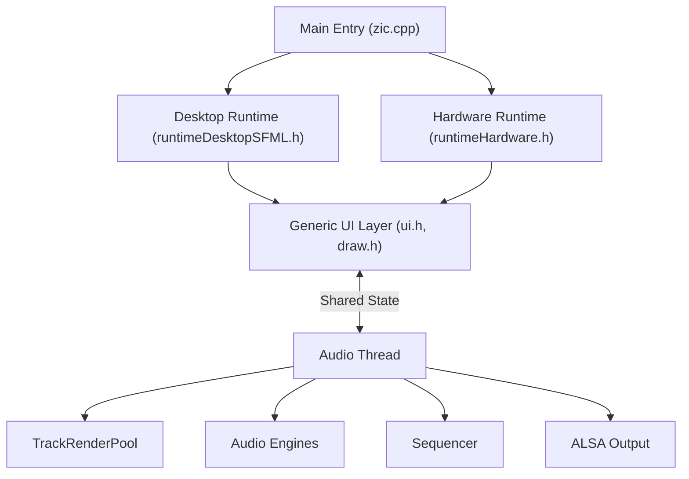
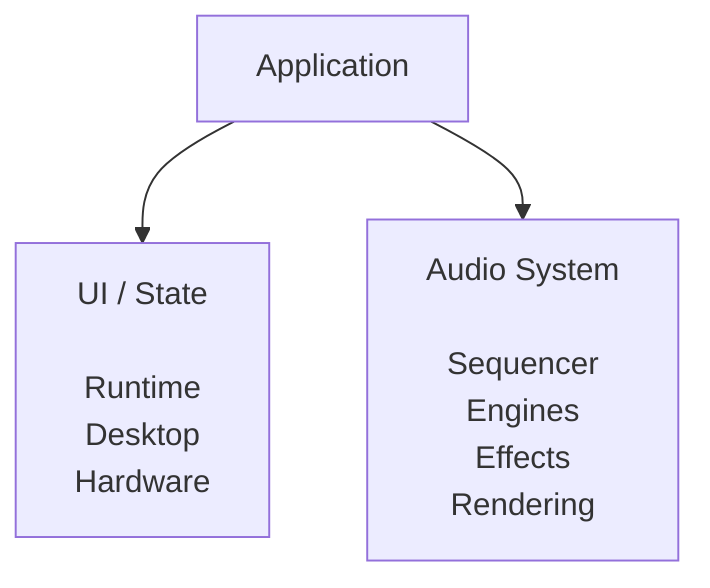

# 02 Architecture & Development Guide

zicBox is a modular C++ framework for building music applications, grooveboxes, synthesizers, sequencers, and custom audio hardware.

The same application can be developed and tested on a desktop computer before being deployed to embedded hardware such as Raspberry Pi, STM32H7, or ESP32. The framework is designed to keep audio processing, application logic, user interface, and hardware integration clearly separated, making projects easier to develop, test, and maintain.

Rather than being a framework tied to a particular device, zicBox provides a common architecture that can be reused across many different music applications.

## Architecture Overview

A zicBox application is built around three independent layers:

1. **Runtime (Hardware Abstraction Layer)** – connects the application to desktop or embedded hardware.
2. **Application & UI** – manages state, navigation, and rendering.
3. **Audio Engine** – handles sequencing, synthesis, DSP, and audio output.

Keeping these layers separate allows applications to run unchanged on different targets while maintaining reliable real-time audio performance.



You can think of the architecture like this:



Each layer has a clear responsibility and communicates with the others through shared application state rather than direct hardware dependencies.

## Runtime Layer

The runtime provides the bridge between the application and its execution environment.

Two runtimes are currently available:

- `runtimeDesktopSFML.h`
- `runtimeHardware.h`

### Desktop Runtime

The desktop runtime is intended for development and testing.

It uses SFML to create a desktop window while mapping keyboard and mouse events onto the same logical controls used by embedded hardware.

This allows you to develop an application without having the target hardware connected.

It also provides a screenshot mode.

Setting:

```text
ZIC_SCREENSHOT=<output_path>
```

automatically renders every application view, exports PNG images, and exits cleanly. This is useful for documentation, testing, and automated screenshot generation.

### Hardware Runtime

The hardware runtime connects the application to physical devices.

Depending on the target platform this may include:

- GPIO buttons
- Rotary encoders
- SPI displays
- Linux framebuffer devices

Hardware mappings can be configured through `config.json` (or `ZIC_CONFIG_PATH`), allowing applications to adapt to different hardware layouts without code changes.

GPIO events are queued safely before being processed by the application, avoiding race conditions between hardware interrupts and the UI.

## Threading Model

Real-time audio has very different requirements from a graphical user interface.

For this reason, zicBox always separates UI processing from audio processing.

| Thread | Scheduling | Responsibility |
|---------|------------|----------------|
| Main Thread | `SCHED_OTHER` | Input, UI updates, rendering |
| Audio Thread | `SCHED_FIFO (30)` | Sequencer, synthesis, DSP, ALSA output |

The UI should never block the audio thread, and the audio thread should never perform slow UI or rendering operations.

This separation is one of the key architectural principles of the framework.

## Multi-Core Audio Rendering

While sequencing must happen in a predictable order, rendering multiple tracks is an ideal candidate for parallel execution.

`TrackRenderPool` distributes track rendering across worker threads while keeping timing-critical operations on the main audio thread.

Rendering happens in two stages.

### Phase 1 – Audio Tick

The audio thread performs all work that must remain serialized:

- advance the sequencer clock
- process step timing
- generate note events
- load clips
- synchronize shared audio state

### Phase 2 – Track Rendering

Once the events for the current frame are known, tracks are rendered in parallel.

Each worker thread produces its own mix buffer before all tracks are combined and passed through the master effects chain.

Typical master effects include:

- Filter
- Compressor
- Scatter
- Tape Saturation
- Soft Clipping

Finally the mixed signal is converted to 16-bit PCM and written to ALSA.

## Audio Engines

All synthesis and sample playback engines are located in:

```text
audio/engines/
```

Every engine derives from `EngineBase` using CRTP.

```cpp
class MyEngine : public EngineBase<MyEngine>
{
public:
    Param params[4];

    Param& pitch = addParam(...);
    Param& cutoff = addParam(...);
    Param& reso = addParam(...);
    Param& volume = addParam(...);

    float sampleImpl();
    void noteOnImpl(...);
    void noteOffImpl(...);
};
```

### Why CRTP?

Unlike traditional virtual inheritance, CRTP allows the compiler to resolve calls at compile time.

For real-time audio this has two advantages:

- no virtual function lookup
- better opportunities for compiler inlining

This is particularly valuable on embedded targets where every CPU cycle matters.

## Engine Parameters

Every engine exposes its controls through `Param` objects.

```cpp
Param& cutoff = addParam({
    .key = "cutoff",
    .label = "Cutoff",
    .value = 0.5f,
    .max = 1.0f
});
```

One important implementation detail is that the parameter array must match the number of registered parameters.

Correct:

```cpp
Param params[4];
```

Incorrect:

```cpp
Param params[3];
```

Registering more parameters than the array can hold results in memory corruption.

## Sequencer

Reusable sequencing components are located in `audio/sequencer/`:

```
audio/sequencer/
├── Step.h
├── Clip.h
├── Generator.h
├── SequenceUtils.h
├── ClipChain.h
└── ProjectIO.h
```

### Step

Defines the basic sequence step.

The default sequence length is 64 steps but can be overridden at compile time.

```text
-DSEQ_STEPS=32
```

### Clip

Represents a sequence together with:

- parameter values
- engine selection
- note repeat information

### Generator

Contains algorithmic pattern generators.

Available generators include:

- Kick
- Bass
- Drum
- Percussion
- Snare
- HiHat
- Clap

These generators can be used directly or exposed through application UI controls.

### Sequence Utilities

Provides helper functions such as:

- stretch
- compress
- clear

### Clip Chains

Provides utilities for creating and managing chains of clips.

### Project Persistence

`ProjectIO.h` is responsible for saving and loading projects.

Projects are serialized using JSON via `nlohmann/json`.

The implementation is intentionally generic so different applications can reuse the same persistence layer.

## Typical Application Flow

A common interaction follows this path:

```text
User Input
     │
     ▼
Runtime
     │
     ▼
Application State
     │
     ▼
Sequencer / Engine
     │
     ▼
Audio Thread
     │
     ▼
TrackRenderPool
     │
     ▼
Master Effects
     │
     ▼
ALSA Output
```

The UI decides **what should happen**.

The audio system decides **when it happens**.

Keeping these responsibilities separate makes applications easier to maintain while preserving reliable real-time performance.

## Typical Project Layout

A typical zicBox application looks like this:

```text
myApp/
├── zic.cpp
├── audioWorker.h
├── runtimeDesktopSFML.h
├── runtimeHardware.h
├── studio.h
├── ui.h
├── uiTrack.h
├── uiSeq.h
├── uiMenu.h
└── makefile
```

Each file has a focused responsibility.

| File | Purpose |
|------|---------|
| `zic.cpp` | Application entry point |
| `audioWorker.h` | Real-time audio loop |
| `runtimeDesktopSFML.h` | Desktop runtime |
| `runtimeHardware.h` | Embedded runtime |
| `studio.h` | Shared application state |
| `ui.h` | Main UI coordinator |
| `ui*.h` | Individual UI screens |
| `makefile` | Build configuration |

## Desktop-First Development

Most applications can be developed entirely on a desktop machine before moving to hardware.

A typical workflow looks like this:

```text
Develop
    │
    ▼
Desktop Testing
    │
    ▼
Audio Development
    │
    ▼
UI Development
    │
    ▼
Deploy to Hardware
    │
    ▼
Hardware Fine-Tuning
```

This significantly reduces development time while allowing hardware-specific adjustments to remain isolated inside the runtime layer.

## AI Coding Assistant Support

The repository also contains AI development skills located in:

```text
.agents/skills/
```

These files are **not part of the runtime**.

Instead, they provide additional context for AI coding assistants such as ChatGPT, Claude, Gemini, or Antigravity, helping them follow the project's conventions when generating or modifying code.

Available skills currently include:

| Skill | Purpose |
|---------|---------|
| `audio-engine` | Creating and modifying audio engines |
| `audio-sequencer` | Sequencer components and generators |
| `firmware-architecture` | Runtime architecture and threading |

These skills are optional. Everything described in this guide can be understood without them.

## Design Principles

When extending zicBox, a few architectural principles are worth keeping in mind.

### Keep hardware at the edge

Platform-specific code belongs inside the runtime layer.

### Keep audio real-time

Avoid blocking operations or UI work inside the audio thread.

### Reuse the engine framework

Follow the existing `EngineBase` pattern when implementing new synths or effects.

### Treat the sequencer as shared infrastructure

Many sequencing features already exist as reusable components.

### Develop on desktop first

The desktop runtime is the fastest way to iterate on new ideas before moving to embedded hardware.

### Respect architectural boundaries

```text
Hardware
    │
    ▼
Runtime
    │
    ▼
Application
    │
    ▼
Shared State
    │
    ▼
Audio
    │
    ▼
Output
```

Whenever you add a feature, first decide which layer it belongs to.

Keeping these responsibilities separate is what allows the same application architecture to scale from a desktop development environment to dedicated embedded music hardware.