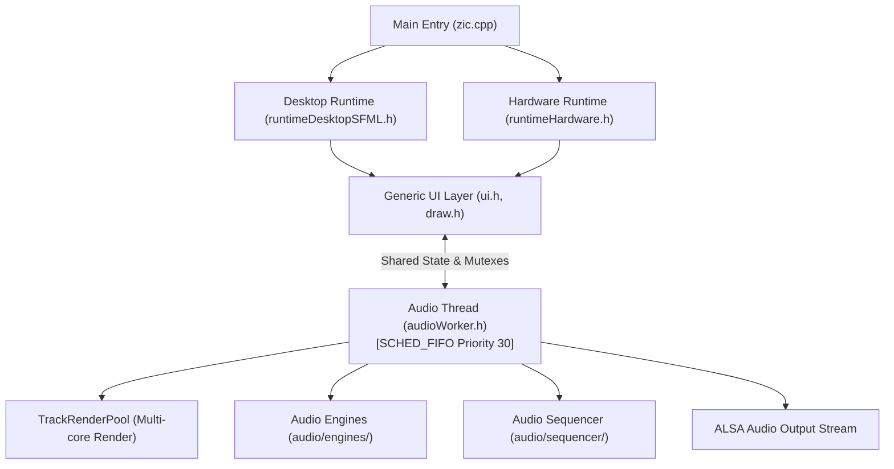

# 02 Architecture & Development Guide

**zicBox** is a modular C++ framework for building music applications, grooveboxes, synths, and custom audio hardware across desktop Linux and embedded targets (e.g., Raspberry Pi, STM32H7, ESP32).

## 1. Core System Architecture

Applications in zicBox follow a **3-tier decoupled architecture** designed to ensure real-time audio stability, portable UI rendering, and hardware abstraction.



### The 3 Architecture Tiers

1. **Target Hardware Abstraction Layer (HAL)** (`runtime*.h`): Manages platform-specific inputs (GPIO keys, rotary encoders, keyboard/mouse) and output displays (SFML desktop window, ST7789 SPI, framebuffer).
2. **Generic Application & UI Layer** (`ui.h`, `draw/`): Handles application state, navigation, visual layout, and component interaction without depending on platform-specific UI frameworks.
3. **High-Priority Audio Engine & Sequencer** (`audioWorker.h`, `TrackRenderPool.h`, `audio/`): Performs real-time audio synthesis, pattern sequencing, and DSP processing on dedicated high-priority threads.

## 2. Firmware & Application Architecture

### Target Hardware Abstraction (`runtime*.h`)
Applications isolate hardware-specific logic behind runtime headers, selected at compile time via preprocessor defines:

* **Desktop Runtime** (`runtimeDesktopSFML.h`):
  * Map PC keys to hardware button definitions (`KEY_F1`..`KEY_F5`, `KEY_1`..`KEY_8`).
  * Includes a **Headless Screenshot Pipeline** (`ZIC_SCREENSHOT=<path_prefix>`): when set, the application renders every view sequentially, exports PNG screenshots, and terminates cleanly for automated documentation.
* **Embedded Hardware Runtime** (`runtimeHardware.h`):
  * **GPIO Key Matrix**: Reads physical push buttons using `GpioKey`.
  * **Rotary Encoders**: Reads quadrature encoders via `GpioEncoder` with speed scaling (`encGetScaledDirection()`).
  * **SPI Display**: Renders pixel buffers directly to physical displays (ST7789 via `DrawToST7789`).
  * **Dynamic Mapping**: Reads GPIO pin configurations from `config.json` (or `ZIC_CONFIG_PATH`), falling back to built-in hardware defaults.
  * **Lock-Free Event Queueing**: Interrupt-driven GPIO events are queued safely and flushed on the main loop iteration to eliminate race conditions.

### Real-Time Thread Isolation
UI and Audio processing **must never share a single thread loop**.

| Thread | Priority | Role |
|---|---|---|
| **Main Thread** (`zicBox_UI`) | `SCHED_OTHER` (Normal) | Hardware/desktop event loop, UI component state updates, display rendering. |
| **Audio Thread** (`zicBox_Audio`) | `SCHED_FIFO` (Priority 30) | Realtime clock timing, step clock processing, multi-track DSP synth rendering, master FX, ALSA buffer writes. |

### Multi-Core Audio Rendering (`TrackRenderPool`)
To fully leverage multi-core CPUs without starving UI rendering or the OS scheduler:
* **Core Reservation**: Allocates worker threads reserving cores for UI and OS tasks (`workers = hardware_concurrency() - 2`).
* **2-Phase Pipeline**:
  1. *Phase 1 (Serial Tick)*: Locks `audioMutex`, advances step clocks, and collects per-track frame events (`noteOn`, `noteOff`, `loadClip`).
  2. *Phase 2 (Parallel Render)*: Renders `N` tracks concurrently across worker threads into thread-local mix buffers, sums partial mixes, applies master FX (Scatter, Filter, Compressor, Tape saturation, Soft clip), and outputs 16-bit PCM to ALSA.

## 3. Audio Engine Framework

All synth, drum, and sample engines reside in [`audio/engines/`](https://github.com/apiel/zicBox/tree/main/audio/engines).


### Static Polymorphism via CRTP
Engines inherit from `EngineBase<Derived>` using the **Curiously Recurring Template Pattern (CRTP)**:

```cpp
#pragma once
#include "audio/engines/EngineBase.h"

class MyEngine : public EngineBase<MyEngine> {
public:
    // CRITICAL: Size N must match the exact number of addParam calls!
    Param params[4];

    Param& pitch   = addParam({ .key = "pitch", .label = "Pitch", .value = 60.0f, .max = 127.0f });
    Param& cutoff  = addParam({ .key = "cutoff", .label = "Cutoff", .value = 0.5f, .max = 1.0f });
    Param& reso    = addParam({ .key = "reso",   .label = "Reso",   .value = 0.1f, .max = 0.95f });
    Param& volume  = addParam({ .key = "vol",    .label = "Volume", .value = 0.8f, .max = 1.0f });

    MyEngine(const float sampleRate = 44100.0f)
        : EngineBase(Synth, "MyEngine", params)
        , sampleRate(sampleRate) {}

    // Required audio render callback
    float sampleImpl() { return 0.0f; }

    // Optional callbacks
    void noteOnImpl(uint8_t note, float velocity) { pitch.value = note; }
    void noteOffImpl(uint8_t note) {}

private:
    float sampleRate;
};
```

> **Why CRTP?** On embedded microcontrollers (such as STM32H7), virtual function calls inside high-frequency sample loops incur vtable lookup overhead and prevent compiler inlining. CRTP resolves implementation calls at compile time, eliminating vtable overhead.

### Engine Parameter Rules
* Declare a fixed-size `Param params[N]` array where `N` matches the exact number of `addParam` registrations.
* **Safety Rule**: Calling `addParam()` more times than the size of `params` causes out-of-bounds memory access and results in a runtime segmentation fault.

## 4. Audio Sequencer & Data Layer


All reusable sequence and persistence components reside in [`audio/sequencer/`](https://github.com/apiel/zicBox/tree/main/audio/sequencer/):

```
audio/sequencer/
├── Step.h           # Step data model & SEQ_STEPS override guard
├── Clip.h           # Clip container & ParamValue data structures
├── Generator.h      # Algorithmic pattern generators (Kick, Bass, Drum, Perc, Snare, Hat, Clap)
├── SequenceUtils.h  # Sequence manipulation (stretch, compress, clear)
├── ClipChain.h      # Clip chain helper utilities (add, remove, clear, toggle)
└── ProjectIO.h      # JSON project & clip persistence (saveClip, loadClip, saveProject, loadProject)
```

### Core Sequencer Features
* **Configurable Step Resolution**: `Step.h` defines step structure guarded by `#ifndef SEQ_STEPS` (default: 64 steps), allowing compile-time overrides (`-DSEQ_STEPS=32`).
* **Clip Container**: `Clip.h` stores track step sequences, active parameter key-value pairs (`ParamValue`), engine IDs, and note repeat settings.
* **Algorithmic Generators**: `namespace Generator` in `Generator.h` provides pattern generation algorithms (Kick, Bass, Drum, Perc, Snare, Hat, Clap) with 4-parameter UI knob overloads and 1-parameter default function wrappers.
* **SFINAE JSON Persistence**: `ProjectIO.h` uses C++17 type traits (`nlohmann/json.hpp`) to serialize and deserialize project and clip files across different `Track` or `Studio` data structures without tight coupling.

## 5. Building Projects with AI Agents (`.agents/skills/`)

zicBox includes **Agent Skills** located in [`.agents/skills/`](https://github.com/apiel/zicBox/tree/main/.agents/skills/). These skills provide specialized domain context and architectural guidelines for AI coding agents (such as Gemini, Antigravity, Claude, ChatGPT, etc.).

When building, refactoring, or extending a zicBox application using AI agents, the agent reads these skill definitions to strictly adhere to established project standards.

### Available Agent Skills

| Skill | Path | Description |
|---|---|---|
| [`audio-engine`](https://github.com/apiel/zicBox/tree/main/.agents/skills/audio-engine/SKILL.md) | `.agents/skills/audio-engine` | Rules for creating audio engines (`EngineBase` CRTP inheritance, parameter array bounds safety, file location, callback casting). |
| [`audio-sequencer`](https://github.com/apiel/zicBox/tree/main/.agents/skills/audio-sequencer/SKILL.md) | `.agents/skills/audio-sequencer` | Standards for sequencer steps, clips, pattern generators (`namespace Generator`), clip chains, and SFINAE JSON persistence. |
| [`firmware-architecture`](https://github.com/apiel/zicBox/tree/main/.agents/skills/firmware-architecture/SKILL.md) | `.agents/skills/firmware-architecture` | Application architecture rules (HAL separation, POSIX realtime threads, `TrackRenderPool` multi-core rendering, screenshot pipeline). |

### Using AI Agents to Develop on zicBox

AI agents equipped with these skills can autonomously perform complex development tasks:

1. **Creating New Audio Engines**: Prompt the agent to generate a new synth or drum engine (e.g., *"Create an FM Percussion engine"*). The agent uses the `audio-engine` skill to automatically write a CRTP engine with exact `Param params[N]` sizing and register it in `audio/engines/`.
2. **Adding Sequencer Generators & FX**: Prompt the agent to add pattern generators or sequence manipulators. The agent uses the `audio-sequencer` skill to follow `namespace Generator` design patterns.
3. **Target Porting & Hardware Architecture**: Prompt the agent to structure a new firmware target or application view. The agent uses `firmware-architecture` to enforce HAL decoupling, real-time priority allocation (`SCHED_FIFO`), and multi-core `TrackRenderPool` rendering.

---

## 6. Canonical Application Directory Layout

When creating a new zicBox application, structure project files according to this standard format:

```
myApp/
├── zic.cpp                 # Main entry point (ALSA initialization, UI loop, realtime audio thread startup)
├── audioWorker.h           # Audio thread loop, ALSA management, sequencer clock, multi-track rendering
├── runtimeDesktopSFML.h    # Desktop SFML window driver, keyboard/mouse mapping, headless screenshot mode
├── runtimeHardware.h       # Target hardware GPIO keys, rotary encoders, ST7789 display driver, config loader
├── studio.h (or state.h)   # Application state container, track arrays, shared audio mutexes
├── ui.h                    # Main UI coordinator, view state switcher, unified event dispatcher
├── ui*.h                   # Individual modular UI view components (e.g. uiTrack.h, uiSeq.h, uiMenu.h)
└── makefile                # Build configuration defining DRAW_SMFL for desktop or embedded targets
```
