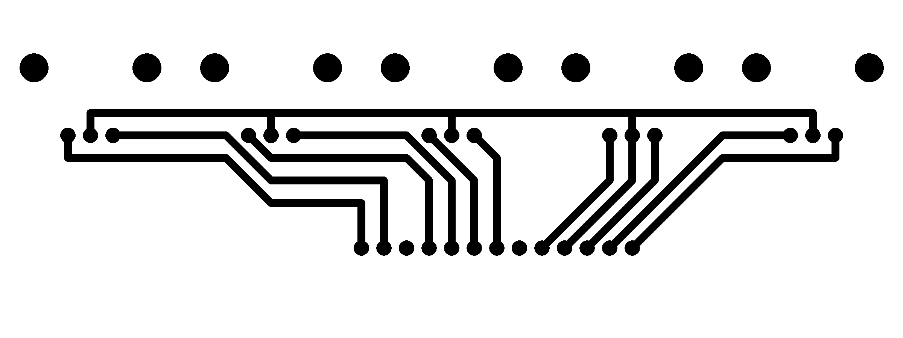
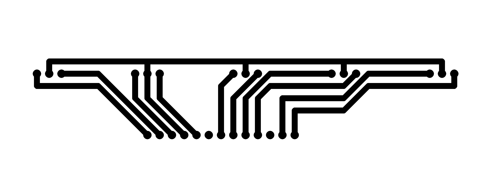

# PCB for zicBox





## gEDA pcb editor

gEDA editor, has builtin gcode export.

```sh
sudo apt-get install pcb
```

Export as gcode, uncheck all box (predrill, drill-mill, advanced-gcode)

Fix gcode to work for laser engraver: `nodejs gcode4laser.js encoder-top.gcode`

Increase the number of passes and update speed using: `nodejs gcodePasses.js encoder-top.gcode 500 3`

> To flip/mirror the layout: 
> - select all element
> - buffer > cut to buffer
> - buffer > mirror buffer (left/right) 

### Settings

- View > Enable visible grid
- Set grid size to 100 mil (this is the specing between pin)

## Raspberry

If gpio 1 is used must update `/boot/config.txt`:

```ini
force_eeprom_read=0
```
